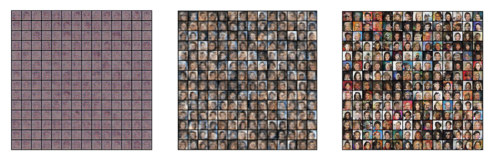
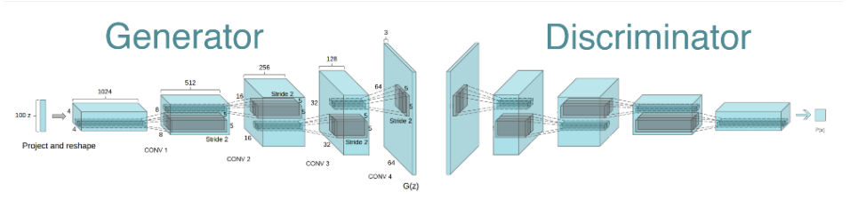
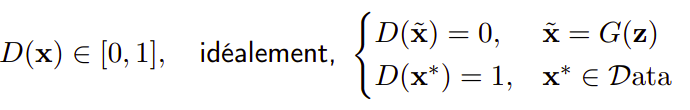
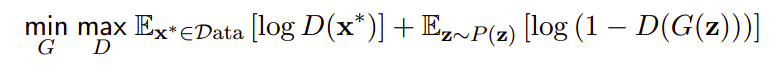
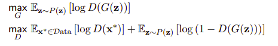
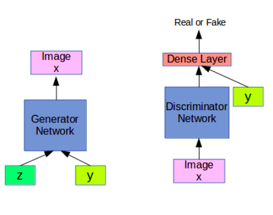
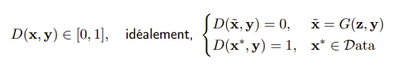
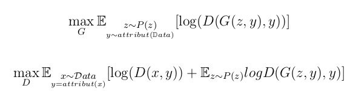

# Mdèles génératifs :

* Nous allons nous intéresser à des modèles génératifs qui modélisent traditionnellement la probabilité jointe P(X, Y) et donc la vraisemblance des données X.

* Dans ce repo on implémente différentes tcéhniques pour la la génération de visage de **célébrité (CELIB DATASET)** et des chiffres **manusicrits (MNIST DATASET)**

  

## Références :

* (Conditional Generative Adversarial Nets)[https://arxiv.org/abs/1411.1784]
* (Generative Adversarial Nets)[https://arxiv.org/pdf/1406.2661.pdf]
* (Unsupervised Representation Learning with Deep Convolutional Generative Adversarial Networks)[https://arxiv.org/abs/1511.06434]

## GAN (Gnerative Adversial Networks):

* Ils ne correspondent pas tout à fait à la définition traditionnelle des modèles génératifs, en sont très proche.
* Capacité à modéliser les structures sous-jacentes aux données les place au coeur des techniques état de l’art en génération, complétion et modification d’images

### objectif (GAN Simple):

**générer une image x** à partir d’une entrée **z** tirée selon une **distribution** pré-définie, et ce quel que soit le z choisi parmi la distribution.
      
**x = G(z), z ∼ P(z)**

### DataSet : 

* ***CELIB_64***

### Architecture :

  

* ***Génarateur G:*** dont l’objectif est de transformer n’importe quel entrée z tiré selon une distribution fixées en image x realiste.

* La fonction de coût permettant l’apprentissage de ce générateur n’est cependant pas évidente, car la distribution P(X) n’est pas connue. Pour contourner ce problème, on propose d’apprendre un second réseau de neurones, le discriminateur D

* ***Discriminateur D :*** . Ce réseau prendre une image en entrée et doit prédire si cette image est une image réelle x du jeu de données ou si c’est une image x˜ produite par le générateur.

  

### Problème à optimiser :

  

D’un point de vue pratique, on **alterne** entre l’apprentissage du générateur et du discriminateur, qui ont chacun une fonction objectif différente dérivée du problème ci-dessus :

  

## cGAN (Conditional Gnerative Adversial Networks):

* cGAN est un GAN conditionné par une variable y, par exemple un vecteur d’attributs. Dans ce cas, nous allons donner y au deux réseaux, voir les figures suivantes :

  

* Voici un exemple de génération par un cGAN

  

### objectif (GAN conditionnel):

**Produire une image x** à partir d’une entrée **y** dont on connaît la sémantique et souvent d’un **“bruit”** **z** équivalent au z du GAN classique.

Par exemple, y peut correspondre à une **classe**, ou à une image d’un autre domaine.

**x = G(z, y), z ∼ P(z)** 

### DataSet : 

* ***MNIST***

### Architecture :

* ***Génarateur conditionnel cG(z, y) :*** génère une image à partir d’un vecteur aléatoire z et d’un vecteur d’attributs y associé à l’image x∗ ∈ Data, une image x telque :
**x = cG(z, y), z ∼ P(z), y = attribut(x∗)** 

* ***Discriminateur conditionnel cD(x, y):*** prédit si l’image x possédant les attributs y est une image réelle x∗ ou une image générée x.

  

### Problème à optimiser :

Les equations des loss de G et D devienent 

  

